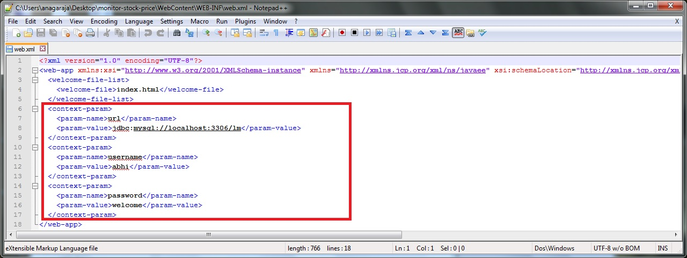

# monitor-stock-price
A project to monitor stock price

###Prerequisites

1. Msp-db-installer: https://github.com/Abhijith-Nagaraja/msp-db-installer

###Steps

1. Clone the project
    
    git clone https://github.com/Abhijith-Nagaraja/monitor-stock-price.git
  
2. Go inside the cloned directory and navigate to WebContent/WEB-INF and open web.xml
   
3. Change the <param-value> for url, username and password in the <context-param> to include your MySQL details
   
4. Navigate back to project root folder and exceute maven install
 
      mvn clean install
<table>
        <tbody>
          <tr>
            <td></td>
            <td></td>
          </tr>
        </tbody>
      </table> 
5. Copy the war folder from projects target directory into your Tomcat server webapp directory and rename if required
 <table>
        <tbody>
          <tr>
            <td></td>
            <td></td>
            <td></td>
          </tr>
        </tbody>
      </table> 
6. Start the Tomcat server
   
7. Open the browser, go to "[your server address with port]://[war-name]/"
   

###Screenshots
1. Trying to login with registering
   
2. Register Page
   
3. Register confirmation
   
4. Dashboard
   
5. Company Dropdown
   
6. After adding three companies
   
7. Historical data
   
8. Logout
   
